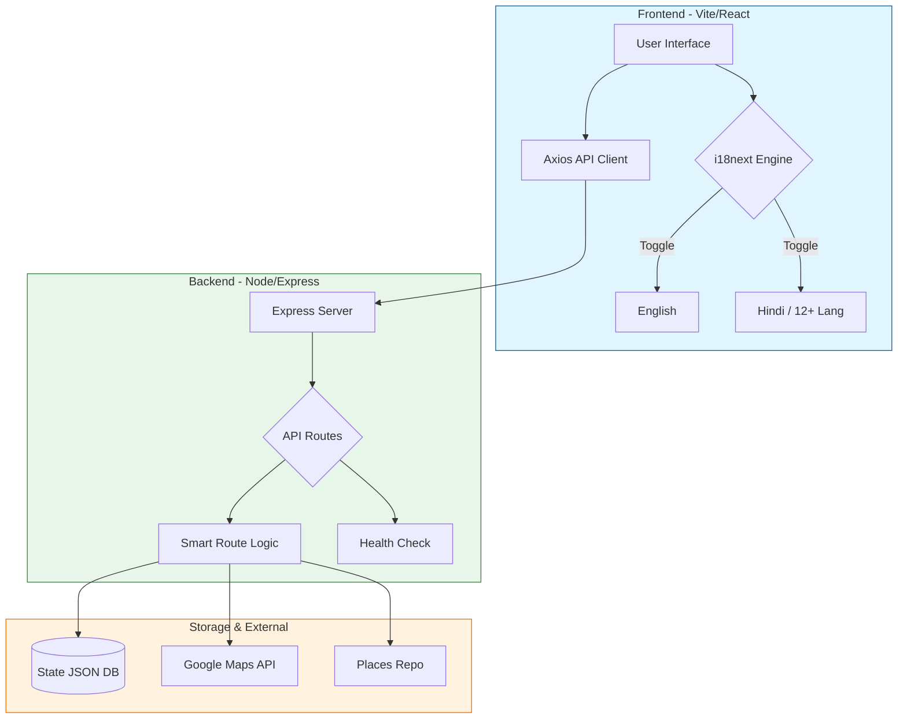

 
  
  
  <h1 align="center">HrRoadways</h1>  
  <p><center>Follow the Maintainer - <a href="linkedin.com/in/nishantrana07">Nishant Rana</a></center></p>
  
<p align="center">
  
  
  
</p>

<div align="center"><p><a href="https://github.com/NishantRana07/HrRoadways/issues"><strong>Report a Bug • </strong></a>
<a href="https://github.com/NishantRana07/HrRoadways/issues"><strong>Request a Feature</strong></a></p>
</div>

<h4 align="center">
  HrRoadways is a comprehensive project designed to provide users with an intuitive platform to check bus routes, timings, and real-time updates for government bus services.
</h4>
<h2 align="center">
  <a href="https://hrroadways.vercel.app/" target="_blank" rel="noopener noreferrer">🌐 Live Demo</a>
</h2>


## 🌟 Vision

Make public bus info simple, reliable, and accessible to everyone — across languages and devices. HrRoadways aims to reduce travel friction by surfacing accurate routes, schedules, and live updates in a lightweight, easy-to-use web app.

  

## 🎯 Mission

Provide an inclusive, multilingual platform that:
- Lets users quickly find bus routes, stops, and timings.
- Delivers real-time status and useful alerts.
- Enables community contributions for better local coverage.
- Keeps privacy, performance, and accessibility as first-class concerns.

  
  
## 💎 Why HrRoadways?

| Feature | Solution Provided |
| :--- | :--- |
| **Multilingual** | Native support for 13+ Indian languages (English/Hindi focus). |
| **Performance** | Optimized React + Vite stack for low-bandwidth mobile devices. |
| **Data Integrity** | Smart Route logic powered by authoritative JSON datasets & Google Maps. |
| **Community** | Open-source places repository for local city updates. |
| **Privacy** | Zero tracking, minimal data collection approach. |

  
  
 <!-- Project Structure as HTML for README.md -->
<h2>📁 Project Structure</h2>
<pre>
HrRoadways/
├── .github/                # GitHub Actions & PR/Issue templates
├── backend/                # Node.js + Express API logic
│   ├── routes/             # API endpoints (SmartRoute, Health)
│   ├── libs/               # Shared backend utilities
│   └── mainServer.js       # Express entry point
├── Databases/              # Centralized JSON storage
│   └── State_Database/     # State-specific bus schedules (Haryana.json)
├── Places/                 # Community-driven location data
│   └── Location/
│       └── Location.json   # Metadata for popular landmarks
├── public/                 # Static assets (Favicon, Manifest)
├── src/                    # Frontend React source code
│   ├── components/         # Reusable UI (Hero, Navbar, Sidebar)
│   ├── i18n/               # Translation locales & config
│   ├── assets/             # Images & Compressed visuals
│   ├── hooks/              # Custom React logic (useTranslation)
│   └── App.jsx             # Main application wrapper
├── .env.example            # Template for API keys
├── vercel.json             # Deployment configurations
└── vite.config.js          # Frontend build tool config
</pre>


  

## 🏗️ System Architecture

HrRoadways follows a robust client-server architecture designed for high availability and multilingual accessibility.


 
  
  
## ⚙️ Tech Stack

<div align="center">

| Technology    | Purpose                                   |
|---------------|--------------------------------------------|
| React + Vite  | Frontend framework & build tooling         |
| React Router  | Client-side routing                        |
| i18next       | Internationalization                       |
| Tailwind CSS  | Utility-first styling                      |
| Framer Motion | Smooth, production-ready animations        |
| Node.js + Express | Backend server                       |
| Axios         | HTTP client for API requests               |

</div>


  
  


<h2 align="center">🌏 National Language Support</h2>

<p align="center">HrRoadways supports <b>13 Indian languages</b> to serve users across India 🇮🇳</p>

<div align="center">

| Language  | Code | Native Name   |
|-----------|------|---------------|
| English   | en   | English       |
| Hindi     | hi   | हिन्दी        |
| Bengali   | bn   | বাংলা         |
| Telugu    | te   | తెలుగు        |
| Marathi   | mr   | मराठी         |
| Tamil     | ta   | தமிழ்         |
| Gujarati  | gu   | ગુજરાતી      |
| Kannada   | kn   | ಕನ್ನಡ         |
| Malayalam | ml   | മലയാളം       |
| Punjabi   | pa   | ਪੰਜਾਬੀ       |
| Oriya     | or   | ଓଡ଼ିଆ        |
| Assamese  | as   | অসমীয়া       |
| Urdu      | ur   | اردو          |

</div>

  
  
<h2 align="center">📝 Language Features</h2>

<div align="center">

| Feature | Description |
|---------|-------------|
| 🔤 Unicode Support | Handles multilingual text seamlessly |
| 🌐 Localization | Supports 2 Indian languages for wider reach |
| 🗂️ Language Files | Each language stored in separate JSON for scalability |
| ⚡ Fast Switching | Toggle between languages instantly |
| 🛠️ Easy Maintenance | Simple structure for adding new languages |

</div>


  
  
<h2 align="center">⚡ For Developers</h2>

### 🚀 Quick Start (Developer Mode)

#### 1️⃣ Clone & Install
```bash
git clone https://github.com/NishantRana07/HrRoadways.git
cd HrRoadways
npm install
```

#### 2️⃣ Environment Setup
Create a `.env` file in the root directory:
```Code snippet
PORT=50001
GOOGLE_MAPS_API_KEY=your_key_here
DB_PATH=./Databases/State_Database/Haryana.json
```

#### 3️⃣ Launch App
```Bash
# Start Backend & Frontend simultaneously
npm run server  # Backend on 50001
npm run dev     # Frontend on 5173
```

### Internationalization (i18n)
The project uses `react-i18next` for translations. Files are in `src/i18n/locales/`.  
To add new translations:
1. Update the appropriate file in `src/i18n/locales/`
2. Use the `useTranslation` hook: `const { t } = useTranslation();`
3. Reference translations with: `{t('key.subkey')}`

### Backend Server

This project includes a backend server built with Node.js and Express to handle API requests.

#### API Endpoints

| Endpoint | Method | Description |
|----------|--------|-------------|
| `/api/health` | GET | Health check endpoint |
| `/api/smartRoute` | POST | Get smart route suggestions |

#### Smart Route API

The smart route API accepts a POST request with the following JSON body:

```json
{
  "source": "Chandigarh",
  "destination": "Delhi"
}
```

It returns route suggestions based on the bus database with optional travel time and distance data from Google Maps API.

### Environment Variables

Create a `.env` file in the root directory with the following variables:

```env
# Server Configuration
PORT=5000
NODE_ENV=development

# API Keys
GOOGLE_MAPS_API_KEY=your_google_maps_api_key_here

# Database Paths
DB_PATH=./Databases/State_Database/Haryana.json
```

To get a Google Maps API key:
1. Go to the [Google Cloud Console](https://console.cloud.google.com/)
2. Create a new project or select an existing one
3. Enable billing for the project
4. Go to "APIs & Services" > "Library"
5. Search for "Distance Matrix API" and enable it
6. Go to "APIs & Services" > "Credentials"
7. Click "Create Credentials" > "API Key"
8. Copy the API key and add it to your `.env` file

---

- Json Database hosting link - https://jsonblob.com/api/jsonBlob/1333092652136194048

  

## Getting Started

1. Clone the repository:
   ```bash
   git clone https://github.com/NishantRana07/HrRoadways.git
   ```
2. Navigate to the project directory and install dependencies:

```bash
npm install
```

3. Create a `.env` file in the root directory with your API keys (see Environment Variables section above)

### Frontend Development

**Development mode** (hot reload):

```bash
npm run dev
```

The app will open at `http://localhost:5173` (default Vite port).

**Production mode** (served by backend):

```bash
npm run build
NODE_ENV=production npm run server
```

The app will be served at `http://localhost:50001` (or port specified in `.env`).

### Backend Server

Run the backend server for API features:

```bash
npm run server
```

- **Development**: Backend API only on port `50001`
- **Production** (`NODE_ENV=production`): Serves both API and built frontend from `/dist`

### Testing the API

**Health Check:**
```bash
curl http://localhost:50001/api/health
```

**Smart Route (Bus search):**
```bash
curl -X POST http://localhost:50001/api/smartRoute \
  -H "Content-Type: application/json" \
  -d '{"source": "Chandigarh", "destination": "Delhi"}'
```

📖 For comprehensive API documentation and more examples, see [`docs/curl_examples.md`](docs/curl_examples.md)

<h1 align="center">Popular Places Repository</h1>
<h4 align="center">
  A centralized repository to store and manage information about popular places across various locations.
</h4>

  

## Format for Adding Popular Places

To add popular places to the repository, follow the format specified below:


  
  
### File Structure

<pre>
Places/
├── Location/
│   └── Location.json
</pre>

### JSON Format

```json
{
  "location": "City or Region Name",
  "places": [
    {
      "name": "Place Name",
      "category": "Category (e.g., Historical, Restaurant, Park, etc.)",
      "description": "A brief description of the place.",
      "latitude": "Latitude Coordinate",
      "longitude": "Longitude Coordinate"
    }
  ]
}
```

## Example

Here is an example of how to add a location:

**File:** `Places/NewYork/NewYork.json`

```json
{
  "location": "New York",
  "places": [
    {
      "name": "Central Park",
      "category": "Park",
      "description": "A large public park in New York City, featuring lakes, gardens, and walking trails.",
      "latitude": "40.785091",
      "longitude": "-73.968285"
    },
    {
      "name": "Statue of Liberty",
      "category": "Historical",
      "description": "An iconic symbol of freedom and democracy located on Liberty Island.",
      "latitude": "40.689247",
      "longitude": "-74.044502"
    }
  ]
}
```

````markdown
<h1 align="center">Contributing & Translation Guidelines</h1>
<h4 align="center">
  Guidelines for contributing to the repository, ensuring Hindi translations, and keeping the codebase updated.
</h4>

## Contributing

If you are adding content to the site or creating new pages, please:

- Apply logic for Hindi translation and add translations for all words.
- Use PNG or JPG files for minimal size and always compress images.
- Ensure that your forked repository is up to date before submitting a pull request.

### Steps for Contributing

#### 1. Fork the Repository:
Click on the **Fork** button at the top right of the repository page.

#### 2. Clone the Forked Repository:
```bash
git clone https://github.com/your-username/HrRoadways.git
````

#### 3. Create a New Branch:

```bash
git checkout -b your-branch-name
```

#### 4. Make Your Changes:

> [!IMPORTANT]
> **Hindi Translation Rule:** Every new UI component must include logic for the `isHindi` state. PRs without corresponding Hindi translations in the `translations.json` will not be merged.

> [!TIP]
> **Image Optimization:** Always compress PNG/JPG assets before uploading to the `/assets` folder to maintain 100/100 Lighthouse performance.

#### 5. Commit Your Changes:

```bash
git add .
git commit -m "Describe your changes"
```

#### 6. Push to the Branch:

```bash
git push origin your-branch-name
```

#### 7. Create a Pull Request:

Go to the original repository and click **New Pull Request**.

  

## Keeping Your Fork Updated

Before making a pull request, ensure that your forked repository is up to date.

#### Add Remote Upstream:

```bash
git remote add upstream https://github.com/NishantRana07/HrRoadways.git
```

#### Fetch Upstream Changes:

```bash
git fetch upstream
```

#### Merge Changes into Main:

```bash
git checkout main
git merge upstream/main
```

#### Push Changes to Your Fork:

```bash
git push origin main
```

By following these steps, your pull request will be based on the latest code.

  

## Translation Documentation

### Overview

The HrRoadways project supports bilingual functionality (English & Hindi). This is achieved through translation logic built into components.

### Implementation

#### Translation Data Structure:

Each component maintains translations for both languages:

```javascript
const translations = {
  en: { heading: "Your English Heading" },
  hi: { heading: "आपका हिंदी शीर्षक" },
};
```

#### State Management:

A state variable (`isHindi`) toggles between languages.

```javascript
const [isHindi, setIsHindi] = useState(false);
const currentLanguage = isHindi ? translations.hi : translations.en;
```

#### Toggle Function:

```javascript
const handleToggleLanguage = () => setIsHindi(!isHindi);
```

  

### Adding Translations to New Components

1. **Define Translations:**

   ```javascript
   const translations = {
     en: { description: "Your English Description" },
     hi: { description: "आपका हिंदी विवरण" },
   };
   ```

2. **Use the Translations:**

   ```javascript
   <p>{currentLanguage.description}</p>
   ```

---

### Example: Hero.jsx

```javascript
const translations = {
  en: {
    heading: "Haryana Roadways - Your Own Bus Service",
    button: "Search Buses",
  },
  hi: {
    heading: "हरियाणा रोडवेज - आपकी अपनी बस सेवा",
    button: "बसें खोजें",
  },
};

const currentLanguage = isHindi ? translations.hi : translations.en;

return (
  <div>
    <h1>{currentLanguage.heading}</h1>
    <button>{currentLanguage.button}</button>
  </div>
);
```

  
  
## Screenshots


 
 
## 🐞 Troubleshooting 

App won't start (dev)
- Check Node version (use Node 16+).
- Run npm install in repo root (or frontend folder if separated).
- Ensure dev server port not in use. Kill conflicting process or change port.
- Missing translations or UI shows keys

- Confirm locale JSON files exist under src/i18n/locales/.
- Restart dev server after adding new keys.
- Use useTranslation() properly and call t('namespace.key').
- Data not loading (API/DB)
- Verify the JSON/DB endpoint is reachable (check CORS).
- If using a hosted JSON blob, ensure the URL is correct and public.
- Inspect browser console / network tab for 4xx/5xx responses.
- Images fail to upload or display
- Confirm storage URL/CORS settings.
- Check file size limits and client-side compression.
- Language switch not persisting

- Make sure selected language is saved to localStorage or user profile.
- Ensure state is read on app init before rendering locale-dependent components.
- Build/Production issues
- Verify environment variables for production (API base URL, any keys).
- Run a local production build (npm run build) and serve the dist to reproduce.

 
 
## Best Practices

* **Always apply translation logic** for new content/pages.
* **Use PNG/JPG** files and compress images before uploading.
* **Keep your fork updated** before submitting PRs.


## Contributor

A heartfelt thank you to all the contributors who have dedicated their time and effort to make this project a success.  
Your contributions—whether it’s code, design, testing, or documentation—are truly appreciated! 🚀

#### Thanks to all the wonderful contributors 💖

<a href="https://github.com/NishantRana07/HrRoadways/graphs/contributors">
  
</a>

See full list of contribution from contributor [Contributor Graph](https://github.com/NishantRana07/HrRoadways/graphs/contributors)


</div>
